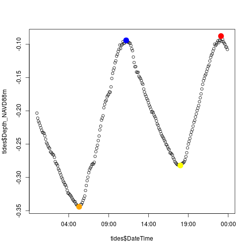

tider
=====

`tider` is an R package for parsing common water level data logger formats to return a variety of commonly used tidal measurements. 

##Installation
`tider` is not currently on CRAN, but can be installed easily with the `devtools` package.


```r
#install devtools if not already done
install.packages("devtools")
library("devtools")

#install tider
install_github("jhollist/tider")
```

##Basic Use
To return higher high, high, low, and lower low from a vector of water levels from a single day:


```r
#Load up example data
file<-system.file("extdata","EDC_WaterLevel_Test.csv",package="tider")
tides<-read.csv(file,stringsAsFactor=F)
#Create a Date/Time vector
tides$DateTime <- lubridate::parse_date_time(paste(tides$Date,tides$Time),
                                  "%m/%d/%y %H:%M:%S")
#Get all values
tide_meas<-daily_hl(tides$Depth_NAVD88m,tides$DateTime)
tide_meas
```

```
## $higher_high
## [1] -0.0878
## 
## $high
## [1] -0.0942
## 
## $low
## [1] -0.282
## 
## $lower_low
## [1] -0.344
```


```r
#plot data
plot(tides$DateTime,tides$Depth_NAVD88m)

#plot tide measurements
#higher high
points(tides$DateTime[tides$Depth_NAVD88m==tide_meas[[1]]],tide_meas[[1]],col="red",pch=19,cex=2)
#high
points(tides$DateTime[tides$Depth_NAVD88m==tide_meas[[2]]],tide_meas[[2]],col="blue",pch=19,cex=2)
#low
points(tides$DateTime[tides$Depth_NAVD88m==tide_meas[[3]]][2],tide_meas[[3]],col="yellow",pch=19,cex=2)
#lower low
points(tides$DateTime[tides$Depth_NAVD88m==tide_meas[[4]]],tide_meas[[4]],col="orange",pch=19,cex=2)
```

 

##EPA Disclaimer
The United States Environmental Protection Agency (EPA) GitHub project code is provided on an "as is" basis and the user assumes responsibility for its use. EPA has relinquished control of the information and no longer has responsibility to protect the integrity , confidentiality, or availability of the information. Any reference to specific commercial products, processes, or services by service mark, trademark, manufacturer, or otherwise, does not constitute or imply their endorsement, recomendation or favoring by EPA. The EPA seal and logo shall not be used in any manner to imply endorsement of any commercial product or activity by EPA or the United States Government.

By submitting a pull request, you make an agreement with EPA that you will not submit a claim of compensation for services rendered to EPA or any other federal agency. Further, you agree not to charge the time you spend developing software code related to this project to any federal grant or cooperative agreement.
